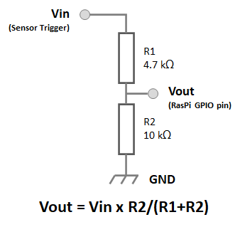

# Motion-Detect Media Player Kodi Addon

## Introduction

This Addon is a Media Player useful to play some video / audio in Kiosk mode only if a people is approaching the sensor.

This Addon is developed on Raspberry Pi (different version are tested, also RasPi WiFi Zero) and require a presence sensor:

* **Ultrasonic Sensor**: because it measure distance, is useful to stop media reproduction if there are no people around
* **PIR Sensor**: is useful to check if someone is approaching, but media is played until it ends (also if there are no people around)

## Configuration

In Setting Page some items help to customize behavior of Addon:

* **Sensor Type**: choose sensor between Ultrasonic (HC-SR04) or PIR (HC-SR501)
* **GPIO pin: Start measure**: Raspberry GPIO pin to start distance measure *(only Ultrasonic)*
* **GPIO pin: Sensor Input**: Raspberry GPIO pin to receive Sensor Input
* **Distance to Start Video**: minimum distance sensor-people to start video - max 400 cm *(only Ultrasonic)*
* **Distance to Stop Video**: maximum distance sensor-people to stop video - max 400 cm *(only Ultrasonic)*
* **Stop Time**: countdown time before stop video if people is too far from sensor; if user re-approach, countdown stop *(only Ultrasonic)*
* **Idle Media Blank**: if activated, in idle mode a black screen is shown
* **Idle Media Content**: if previuos setting is not activated, in idle mode a custom media file can be reproduced in loop
* **Media to Play**: choose media to reproduce when someone approach sensor
* **Start Test**: show a test dialog for snsor, useful to tune previous settings
* **Stop Addon**: useful to stop this addon during tests

To start this addon, use instead default *Open* button in Addon Page.

If you want to start this addon at Kodi boot, I suggest to use [Kodi Autoplay Addon](https://github.com/leo-c/service.autoexec.addon)
(check correct branch for your Kodi version)

## Hardware

### HC-SR04 (Ultrasonic)

This Ultrasonic sensor require 5Vcc for powering, and produce output at 5V, then a simple voltage divider is needed:
  
(also works with 2 resistances both of 5k ohm - 10 kohm because Raspberry inputs can be driven also with 2.5 V)

Luckily, sensor accept any trigger signal above 2.5V, then Raspbery can drive it directly with a 3.3V signal

Wiring follows:
| RasPi GPIO pin # | Raspi GPIO pin signal | HC-SR501 pin |        Notes        |
| :--------------: | :-------------------: | :----------: | :------------------ |
|        2         |         +5V           |     Vcc      |                     |
|        6         |         GND           |     GND      |                     |
|        16        |       GPIO #23        |   Trigger    |                     |
|        18        |       GPIO #24        |    Echo      | use voltage divider |

### HC-SR501 / HC-SR505 (PIR)

Those PIR sensors must be feeded with 5V, but produce output at 3.3 V, so they does not require other electronic components

Wiring follows:
| RasPi GPIO pin # | Raspi GPIO pin signal | HC-SR501 pin |
| :--------------: | :-------------------: | :----------: |
|        2         |         +5V           |     Vcc      |
|        6         |         GND           |     GND      |
|        18        |       GPIO #24        |     OUT      |

## Compatibility

This Addon was tested on following platforms:
|   Kodi version  |       Distribution       |             HW             | Works | Branch | Notes |
| :-------------: | :----------------------: | :------------------------: | :--: | :----: | :---- |
| Kripton - 17.6 | LibreELEC-RPi.arm-8.2.5  | RasPi v1.2 model B+        |   N   |   -    | It seems that this addon cannot run on Kripton (tested on LE v17.6) because required Rpi-tool module (v8.2, to be manually installed) cause restart of RasPi when GPIO is activated (maybe I will do further investigations) |
| Leia - 18.9    | LibreELEC-RPi.arm-9.2.6  | RasPi v1.2 model B+        |   Y   |  leia  | Require Rpi-Tools distributed in LibreElec Repository |
| Matrix - 19.1  | LibreELEC-RPi.arm-10.0.0 | RasPi v4 model B with 4GB  |   Y   | matrix | Require Rpi-Tools distributed in LibreElec Repository |

## Installation

Unless this addon was not included in a Kodi repository, must be installed manually.
To do so:
1. download this github repository as .zip
2. transfer file on host with Kodi (via network, USB memory, etc.)
3. in addon section choose "Install from .zip file" and browse file location
   (remember - if not asked - to enable installation of .zip addon from Setings -> Addon -> unknown source)

## Localization

If you want to add other localizations, you're welcome!
(send me `string.po` file and Addon description in addon.xml or do a Pull Request)

## Acknowledgments

The use of this Addon is free also for Business use.
But, if You use it in a Museum, please send me a photo of location and context!

## References

1. [HC-SR04 datasheet](https://cdn.sparkfun.com/datasheets/Sensors/Proximity/HCSR04.pdf)
2. [HC-SR501 datasheet](https://cdn-learn.adafruit.com/downloads/pdf/pir-passive-infrared-proximity-motion-sensor.pdf)
3. [HC-SR505 datasheet](https://www.sigmaelectronica.net/wp-content/uploads/2014/06/HC-SR505.pdf)
